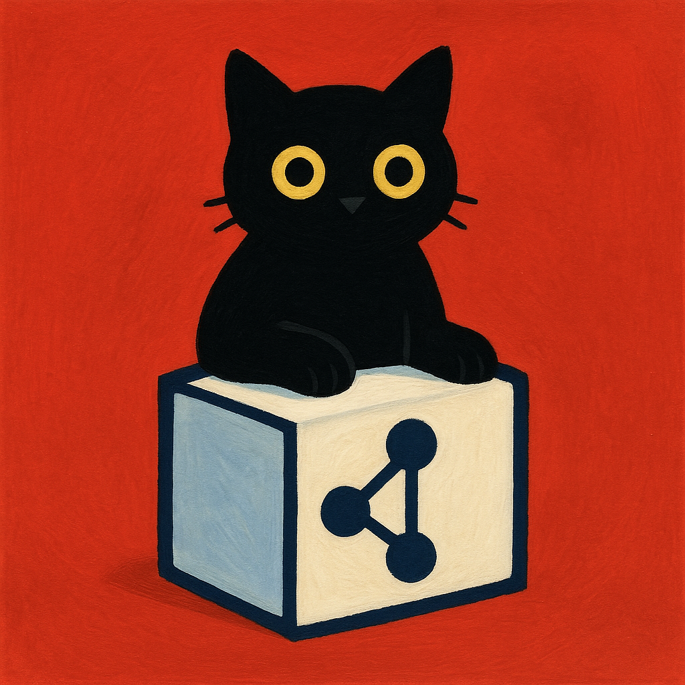

# OmniQueue Core

<p align="center">
  
</p>


**One API – Every Queue** — minimal contracts & runtime for dynamically switching between multiple message brokers (RabbitMQ, Kafka, AWS SQS, Azure Service Bus, NATS JetStream, BullMQ, ZeroMQ, …).

> *The core is 100 % dependency‑free TypeScript. Adapters self‑register at import‑time; you choose the provider at runtime.*

---

## ✨ Why OmniQueue?

| Problem                                              | OmniQueue Core Solution                                                                                                                                    |
| ---------------------------------------------------- | ---------------------------------------------------------------------------------------------------------------------------------------------------------- |
| Codebase tightly coupled to one broker               | Standardised **`Broker`** and **`BrokerMessage`** interfaces decouple application logic from provider APIs.                                                |
| Hard to swap or test alternative brokers             | **Runtime factory** (`create(provider,cfg)`) chooses the implementation dynamically.                                                                       |
| Adapter zoo, each with its own API surface           | **Plugin registry** (`register()`) lets each adapter expose itself under a single ergonomic API.                                                           |
| Missing common guarantees (ack/nack, DLQ, priority…) | Spec enforces explicit **ack/nack**, retry/DLQ hooks, priority & delay semantics. Magic decorators add wow‑features (time‑travel, idempotency, tracing …). |

---

## 🏗️ Architecture (Core only)

```
┌────────────────────┐          side‑effect import          ┌────────────────────────┐
│  @omniqueue/core   │ <─────────────────────────────────── │  @omniqueue/rabbitmq   │
│ • BrokerMessage    │   register("rabbitmq",factory)     │  (adapter package)     │
│ • Broker           │                                       └────────────────────────┘
│ • register()       │
│ • create()         │ ───────────────→  returns concrete Broker instance
└────────────────────┘
```

---

## 🚀 Quick Start

```bash
# Monorepo root
yarn add @omniqueue/core @omniqueue/rabbitmq @omniqueue/kafka  # adapters are peer‑dep
```

```ts
import "@omniqueue/rabbitmq";   // auto‑registers provider "rabbitmq"
import "@omniqueue/kafka";
import { create } from "@omniqueue/core";

const provider = process.env.MQ_PROVIDER ?? "rabbitmq";
const cfg = provider === "kafka"
  ? { brokers: ["localhost:9092"] }
  : { url: "amqp://localhost" };

const mq = await create(provider, cfg);
await mq.publish("tasks", { id: "1", body: { hello: provider }, headers: {} });
await mq.subscribe("tasks", async msg => {
  console.log(msg.body);
  await msg.ack();
}, "group1", {});
```

---

## 📝 Core API

```ts
export interface BrokerMessage<T = any> {
  id: string;      // ULID / UUID v7
  body: T;
  headers: Record<string, any>;
  ack(): Promise<void>;
  nack(requeue?: boolean): Promise<void>;
}

export interface Broker {
  readonly provider: string;
  publish(topic: string, msg: Omit<BrokerMessage, "ack"|"nack">, opts?: { prio?:number }): Promise<void>;
  subscribe(topic: string, handler: (m: BrokerMessage) => Promise<void>, groupId: string, opts?: { prio?:number }): Promise<void>;
  close(): Promise<void>;
}
```

> ✅ No external deps. Strict TS, ES2022 output, d.ts bundled via Vite.

---

## 🔌 Writing an Adapter

```ts
import { Broker, BrokerMessage, register } from "@omniqueue/core";
import { connect } from "amqplib"; // example: RabbitMQ driver

class RabbitBroker implements Broker {
  readonly provider = "rabbitmq";
  /* …implementation… */
}

register("rabbitmq", async cfg => new RabbitBroker(cfg));
```

*Publish the adapter as `@omniqueue/rabbitmq` with `peerDependency` on `@omniqueue/core`.*

---

## 🪄 Magic Decorators (roadmap)

* `later()`  — delay / schedule message.
* `tracing()` — automatic W3C TraceContext via OpenTelemetry.
* `idempotent()` — Redis/SQLite key guard (`idem:<queue>:<id>`).
* `priority()` with dedicated‑lane consumers.
* `zeroDrop()` — outbox + tx ACK channel.

Adapters only need to expose primitives; decorators compose cross‑provider features.

---

## 🛣️ Roadmap

* [x] Core contracts & registry
* [ ] RabbitMQ adapter (baseline)
* [ ] Kafka (kafkajs) adapter
* [ ] SQS / FIFO adapter
* [ ] Magic‑later decorator
* [ ] TypeDoc PicoCSS theme (`typedoc-omniqueue-theme`)

See `docs/roadmap.md` for full tracker.

---

## 🤝 Contributing

Pull requests welcome! Run the full pipeline:

```bash
yarn install
pnpm turbo run build
```

Please follow the Conventional Commits spec; Changesets handles semver.

---

## 🏷️ License

[MIT](LICENSE)
